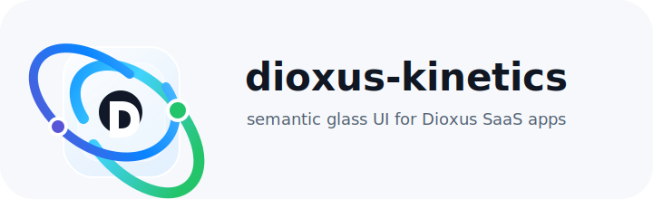

<p align="center">
  
</p>

# dioxus-kinetics

`dioxus-kinetics` is a Dioxus-first UI library workspace for downstream SaaS products. It combines semantic component names, Apple-like glass materials, renderer-neutral tokens, reusable library CSS, and a single public facade crate.

The logo in this repository is an original `dioxus-kinetics` mark. It references Dioxus-adjacent ideas like cross-platform motion, Rust UI energy, and layered glass, but it is not the Dioxus logo or a traced copy of Dioxus branding.

The intended downstream import is:

```rust
use kinetics::prelude::*;
```

## What This Repository Contains

This repository is a Rust Cargo workspace. The public API is exposed through `crates/kinetics`; the other crates keep design tokens, material recipes, motion math, layout math, renderer adapters, and optional backend boundaries focused.

Ready rendered components:

- `Button`
- `TextField`
- `Checkbox`
- `Switch`
- `CommandMenu`
- `Toolbar`
- `Stack`
- `Tabs`
- `Sidebar`
- `Surface`
- `GlassSurface`
- `MetricCard`
- `Dialog`
- `Toast`
- `Tooltip`
- `EmptyState`
- `Sequence`
- `SharedLayout`
- `SharedElement`
- `Scene`
- `Clip`
- `KineticBox`
- `KineticText`
- `Presence`
- `PresenceGate`
- `TimelineScope`
- `SplitText`
- `MotionPath`
- `FrameStage` (legacy, kept as deprecation shim)
- `LowerThird`
- `Caption`
- `WipeTransition`
- `MetricCounter`
- `SocialOverlay`

## Design Principles

- Semantic component names based on role and behavior.
- One downstream-facing crate: `kinetics`.
- Apple-like glass styling with solid fallback behavior.
- Reusable `.ui-*` styling exposed through `ui-styles` for downstream apps.
- Web, Desktop, Mobile, and Native adapter boundaries.
- Accessibility and reduced-preference policies at the token and contract level.
- WCAG 2.2 AA as the target for default themes.
- Native timeline, composition, and capture boundaries kept inside the Rust/Dioxus system model.
- Renderer-neutral core logic wherever possible.

## Workspace Layout

```text
crates/
  ui-core/          semantic contracts, roles, IDs, target sizing, a11y policy
  ui-tokens/        color, radius, spacing, density, motion, and preference tokens
  ui-glass/         glass material requests and resolved recipes
  ui-motion/        transition, spring, and presence primitives
  ui-layout/        renderer-neutral FLIP layout math
  ui-dom/           CSS/style serialization for WebView and web targets
  ui-native/        native capability planning for glass rendering
  ui-dioxus/        semantic Dioxus components
  ui-styles/        shared library CSS variables and component classes
  ui-timeline/      native timeline, stagger, presence, scroll, and shared movement contracts
  ui-composition/   native frame composition and deterministic frame sampling
  ui-capture/       native capture stages, viewport profiles, marks, and export manifests
  ui-runtime/       animation runtime: frame scheduler and dioxus hooks
  ui-icons/         curated inline-svg icon components
  ui-blocks/        catalog of reusable cinematic Scene blocks
  kinetics/         public facade and prelude
  kinetics-render/  frame-by-frame SSR exporter (HTML + optional PNG/MP4)
  kinetics-cli/     kinetics CLI (init/preview/render/lint/doctor)
examples/
  component-gallery/ runnable Dioxus documentation gallery
docs/
  component-naming.md
  glass-materials.md
  platform-support.md
```

## Features

Default `kinetics` features:

- `web`
- `desktop`
- `mobile`
- `tokens`
- `glass`
- `motion`
- `layout-motion`
- `a11y`
- `timeline`
- `composition`
- `capture`
- `runtime`
- `icons`

Optional features:

- `native`
- `a11y-tests`

Example:

```powershell
cargo test -p kinetics --no-default-features --features native
cargo test -p kinetics --no-default-features --features "native timeline composition capture"
```

## Component Gallery

The runnable documentation app lives in `examples/component-gallery`.

It shows the component library category by category:

- a short writeup for each component
- a Rust usage snippet
- a rendered example for ready components
- accessibility notes for every entry
- shared library CSS plus gallery-only layout CSS
- static theme and density preview controls
- disabled coming-soon entries for planned components

Check the gallery:

```powershell
cargo check -p component-gallery
```

Run the gallery with the Dioxus CLI when available:

```powershell
dx serve --package component-gallery
```

The CLI defaults to port `8080`. If another process already owns 8080 (a common culprit on Windows is the Apache instance bundled with EnterpriseDB Postgres at `httpd.exe`), `dx serve` will print "Serving your app" but you will see the other process at `http://localhost:8080`. Diagnose with `netstat -ano | findstr :8080` and pass a free port:

```powershell
dx serve --package component-gallery --port 9173
```

The gallery is registry-driven. To add a future component to the docs, update the registry in `examples/component-gallery/src/docs.rs` with its category, status, summary, snippet, accessibility note, and renderer.

## Flagship Marketing Page

A self-referential marketing page for `dioxus-kinetics` lives in
`examples/flagship`. It composes existing scenes
(`ProductIntroScene`, `ScrollPinnedStoryScene`, the glass triplet,
`MetricCounter` strip, and a CTA band) at full bleed, with no
documentation chrome. Use it as a reference for what shipping with
kinetics actually looks like, and as the binding visual check for
the workspace's Apple-quality story.

```powershell
dx serve --package flagship --port 9174
```

Open `http://localhost:9174` in a browser that supports WebGPU (the
glass triplet section reveals the WebGPU `ui-glass-engine` path; on
non-WebGPU browsers it falls back through SVG filter to solid).

The binding visual check is documented in
`docs/superpowers/specs/2026-05-25-flagship-marketing-page-design.md`
(the "Hero-3-seconds" check). The reference screenshot lives at
`examples/flagship/docs/hero-screenshot.png`.

## Render & CLI

The workspace ships a Rust frame-by-frame SSR exporter and a CLI
front-end.

`kinetics-render` walks any `Scene` via `SceneClock { driver: Manual }`,
serializes each frame via `dioxus-ssr`, and writes per-frame HTML +
an `ExportManifest` JSON. Optional stages capture PNGs via a
Playwright sidecar and encode MP4 via FFmpeg; both stages
gracefully skip when their tools are not on PATH.

The `kinetics` CLI wraps the renderer plus the dev-loop:

```powershell
cargo run --bin kinetics -- --help
cargo run --bin kinetics -- doctor
cargo run --bin kinetics -- render --scene product-intro --out ./out --frames 60 --fps 30
```

See `crates/kinetics-cli/src/main.rs` for the full subcommand
surface.

## AI Agent Integration

A Claude Code skill ships at `.claude/skills/kinetics-scene/SKILL.md`.
Agents loaded into this workspace can use it to author Scene
compositions with the correct API surface: `Scene` / `Clip` /
`SceneDriver`, `SplitText` / `MotionPath`, the `ui-blocks` catalog,
reduced-motion + accessibility patterns, and the workspace's TDD
conventions.

To activate it in an external editor session that uses Claude Code,
clone the workspace and let the agent auto-discover `.claude/skills/`.

## Quick Start

Clone the repository, then run:

```powershell
cargo test --workspace
```

Format check:

```powershell
cargo fmt --all -- --check
```

Focused gallery checks:

```powershell
cargo check -p component-gallery
cargo test -p component-gallery
```

## Public Usage Example

```rust
use kinetics::prelude::*;

let css = library_css();
assert!(css.contains(".ui-command-menu"));

let theme = Theme::default();
let recipe = resolve_glass(
    &theme,
    GlassRequest::new(
        GlassLevel::Floating,
        GlassTone::Neutral,
        GlassDensity::Comfortable,
    ),
);

assert_eq!(ButtonVariant::Primary.class_name(), "ui-button ui-button--primary");
assert_eq!(recipe.backdrop_blur_px, 18.0);
```

Example Dioxus usage:

```rust
use dioxus::prelude::*;
use kinetics::prelude::*;

#[component]
fn Example() -> Element {
    rsx! {
        Stack {
            gap: "md".to_string(),
            TextField {
                id: "workspace-name",
                label: "Workspace name",
                value: "Acme Ops",
                help_text: "Visible to teammates",
            }
            Switch {
                id: "auto-renew",
                label: "Auto renew",
                checked: true,
                description: "Keep billing active",
            }
            MetricCard {
                label: "Net revenue",
                value: "$128.4k",
                delta: "+12.5%",
                tone: MetricTone::Success,
            }
            Toast {
                tone: ToastTone::Success,
                title: "Report exported",
                description: "The PDF is ready.",
            }
        }
    }
}
```

Shared CSS can be rendered once near the application root:

```rust
use dioxus::prelude::*;
use kinetics::prelude::*;

#[component]
fn App() -> Element {
    let css = library_css();

    rsx! {
        style { "{css}" }
        div {
            "data-ui-theme": "light",
            "data-ui-density": "comfortable",
            Stack {
                Button { "Save changes" }
            }
        }
    }
}
```

## Glass Materials

Glass is represented by a renderer-neutral recipe:

- `GlassLevel`
- `GlassTone`
- `GlassDensity`
- `GlassPolicy`

Web, Desktop, and Mobile WebView paths use `backdrop-filter` when supported. Native targets use the same recipe and map it through `NativeCapabilities`. Reduced transparency and solid fallback policies force a non-blurred surface.

See `docs/glass-materials.md` for the material model.

## Platform Support

| Target | Status | Backend |
|---|---|---|
| Web | MVP | DOM style adapter |
| Desktop | MVP | WebView DOM style adapter |
| Mobile | MVP | WebView DOM style adapter |
| Native | MVP contract | Native capability adapter |

Timeline, composition, and capture are native Rust/Dioxus systems usable through web, desktop, mobile WebView, and platform-native adapters. They do not depend on third-party animation, video, or capture runtimes.

See `docs/platform-support.md` for more detail.

## Current Status

This is an MVP library foundation. The current implementation includes:

- semantic token scales
- accessibility contracts
- glass material recipes and fallbacks
- motion primitives
- FLIP layout math
- DOM/WebView style adapter
- native capability adapter
- Dioxus semantic component MVP
- advanced SaaS controls and surfaces
- reusable shared CSS crate
- native timeline boundary
- native frame composition boundary
- native capture manifest boundary
- unified facade crate
- component gallery example app

Future phases should add overlay managers, focus trapping, runtime theme/density switching, keyboard engines, data-heavy workflow components, visual regression checks, native fidelity work, and deeper backend integrations.

## Documentation

- `docs/component-naming.md`
- `docs/glass-materials.md`
- `docs/platform-support.md`
- `docs/superpowers/specs/2026-05-20-unified-ui-library-design.md`
- `docs/superpowers/specs/2026-05-20-component-gallery-design.md`
- `docs/superpowers/specs/2026-05-20-advanced-ui-wave-design.md`
- `docs/superpowers/plans/2026-05-20-unified-ui-library.md`
- `docs/superpowers/plans/2026-05-20-component-gallery.md`
- `docs/superpowers/plans/2026-05-21-advanced-ui-wave.md`
- `docs/superpowers/specs/2026-05-24-scene-player-design.md` — SP-1 Scene player (Scene, Clip, SceneDriver)
- `docs/superpowers/plans/2026-05-24-scene-player.md`
- `docs/superpowers/specs/2026-05-25-gsap-tier-primitives-design.md` — SP-3 motion primitives (SplitText, MotionPath)
- `docs/superpowers/plans/2026-05-25-gsap-tier-primitives.md`
- `docs/superpowers/specs/2026-05-25-render-cli-catalog-design.md` — SP-4+5+6 render + CLI + ui-blocks catalog
- `docs/superpowers/plans/2026-05-25-render-cli-catalog.md`
