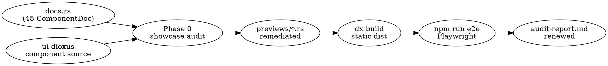

# Gallery Showcase Audit + Playwright Verification

## Goal

Make sure every component in the gallery actually **demonstrates** the
capabilities its `docs.rs` summary advertises — not just renders the
component shell — and that the e2e harness (Playwright) covers the
three new components (`Combobox`, `RadioGroup`, `DropdownMenu`) with
behavioral specs + visual baselines.

The previous audit-report says all 45 components are "ready" because
smoke + visual tests pass. That tells us they render without errors and
match a baseline; it does **not** tell us whether the baseline visibly
exposes the feature. Components like `DatePicker`, `Select`, `Popover`,
and `Dialog` currently render only a closed trigger — the calendar
grid, listbox, modal panel never appear in the screenshot. This spec
fixes that gap and lands behavioral specs for the new wave.

This is verification work, not new features. No new components, no API
changes — only `examples/component-gallery/src/previews/*.rs` edits and
`examples/component-gallery/e2e/tests/components/*.spec.ts` additions.

## Scope

This spec lands:

1. A **showcase audit** of all 45 components in `docs.rs`. Each component
   gets a verdict: "showcased" or "remediate" + the remediation pattern.
   The audit table is the source of truth for what changes in Phase 0.
2. Targeted edits to `examples/component-gallery/src/previews/*.rs` for
   every component the audit flags. Edits are surgical — most will be
   single-prop changes (`open: true`, `present: true`, render-in-grid)
   not rewrites.
3. Three new behavioral spec files in
   `examples/component-gallery/e2e/tests/components/`:
   - `combobox.spec.ts`
   - `radio-group.spec.ts`
   - `dropdown-menu.spec.ts`
4. Regenerated visual snapshot baselines for every component whose
   preview body changed in Phase 0, plus 24 fresh baselines for the
   three new components (3 components × 4 variants × 2 browsers).
5. A regenerated `audit-report.md` showing all 45 components ready.

Out of scope: video recording, MP4 artifacts, new component
implementations, refactors of any preview that already showcases its
feature.

## Audit methodology

For each component, the audit cross-references three sources:

1. **Documentation truth** — `docs.rs` entry: `summary`, `accessibility`,
   `snippet` fields. These are the user-facing claims about what the
   component does.
2. **Implementation truth** — `crates/ui-dioxus/src/*.rs` (or
   `crates/ui-dioxus/src/overlays/*.rs`): the component's props,
   variants, role attributes, and the static text of any feature
   summary.
3. **Preview truth** — `examples/component-gallery/src/previews/*.rs`:
   what the gallery body actually renders.

The component is flagged **remediate** when:

- The summary names a *variant set* the preview does not show
  (e.g. "Neutral/Success/Warning/Danger/Info" tones but the preview
  shows only Neutral).
- The summary names an *overlay panel* (popover, listbox, dialog,
  calendar grid, menu) that does not visibly render in the preview's
  static snapshot.
- The summary names a *state* (loading, disabled, indeterminate,
  invalid) that is not represented.
- The summary names *motion* (animation, transition, progress) and the
  preview renders nothing animated or the still frame at t=0 conveys
  no information.

The component is **showcased** when the preview already renders the
union of variants and states the summary names. Examples already
showcased: `Button` (4 variants visible), `IconButton` (3×3 matrix),
`SegmentedControl` (all options visible).

## Remediation patterns

| Pattern | When | How |
|---|---|---|
| **Open overlay** | Component sits inside Popover/Dialog/CommandMenu | Set `open: true` (or pre-opened `use_signal(\|\| true)`) so the panel renders in the static snapshot |
| **Variant grid** | Summary names ≥3 variants/tones/sizes not all shown | Wrap previews in `gallery-variant-grid` and render every variant (match IconButton's pattern) |
| **Pinned motion frame** | Component is motion-driven (Presence/Kinetic*/Sequence) | Render in the present/visible state; for time-based motion, pin to a representative frame so the static snapshot shows the effect, not the t=0 baseline |
| **State bouquet** | Summary names states (disabled/invalid/loading) | Add a second preview tile inside the same body that exhibits the state |
| **Persistent overlay** | Toast/Alert (transient by nature) | Render with the surface forced visible |

Each remediation must keep the preview self-contained — no new exports
from `kinetics::prelude`, no new helpers beyond what already exists.

## Per-component audit (finalized)

Verdicts updated after the Phase 0 audit pass. "Showcased (already)"
means the preview was left untouched. "Remediated" means a preview
edit was applied; the column lists the actual edit shipped.

| Component | Category | Verdict | What ships |
|---|---|---|---|
| Surface | Foundations | showcased (already) | — |
| GlassSurface | Surfaces | showcased (already) | 1 tile kept; a 3-level grid would create 3 extra WebGL contexts on webkit and exceed the per-page limit. GlassLayer (foundations) already showcases the level/tone matrix. |
| GlassLayer | Foundations | showcased (already) | 3×3 grid present |
| LiquidSurface | Foundations | showcased (already) | gradient bg + ambient mesh visible |
| Button | Actions | showcased (already) | 4 variants visible |
| IconButton | Actions | showcased (already) | 3×3 matrix |
| CommandMenu | Actions | showcased (already) | `open: true` already |
| Toolbar | Actions | showcased (already) | primary commands visible |
| DropdownMenu *(new)* | Actions | **remediated** | `default_open: true` (added prop) → menu visible |
| TextField | Inputs | **remediated** | 3-tile grid (default + invalid+error + disabled) |
| Checkbox | Inputs | showcased (already) | checked + label visible |
| Switch | Inputs | showcased (already) | toggle visible |
| SegmentedControl | Inputs | showcased (already) | all options visible |
| Slider | Inputs | showcased (already) | thumb + value visible |
| Select | Inputs | **remediated** | `default_open: true` (added prop) → listbox visible |
| DatePicker | Inputs | **remediated** | `default_open: true` (added prop) → calendar grid visible |
| DataTable | Inputs | showcased (already) | rows + sortable headers visible |
| Combobox *(new)* | Inputs | **remediated** | `default_open: true` (added prop) → filtered list visible |
| RadioGroup *(new)* | Inputs | showcased (already) | options inline with descriptions |
| Stack | Layout | showcased (already) | gap visible |
| Tabs | Layout | showcased (already) | selected tab + panel visible |
| Sidebar | Layout | showcased (already) | sections visible |
| Accordion | Layout | showcased (already) | "billing" expanded; disclosure pattern visible |
| Breadcrumb | Navigation | showcased (already) | trail visible |
| Pagination | Navigation | showcased (already) | page list visible |
| Stepper | Navigation | showcased (already) | active + complete + upcoming visible |
| MetricCard | Surfaces | **remediated** | 4-tone grid (Neutral/Success/Warning/Danger) |
| EmptyState | Feedback | showcased (already) | message + cta visible |
| Dialog | Feedback | **remediated** | `open: true` by default; Reopen trigger alongside |
| Toast | Feedback | **remediated** | pre-seeded 4 toasts (Success/Info/Warning/Danger) |
| Tooltip | Feedback | **remediated** | 2-tile grid: always-visible showcase + hover-driven |
| Popover | Feedback | **remediated** | `open: true` by default |
| Alert | Feedback | showcased (already) | 5-tone grid (Neutral/Success/Warning/Danger/Info) |
| Progress | Feedback | showcased (already) | determinate (0/65/100%) + indeterminate |
| Skeleton | Feedback | showcased (already) | headline + paragraph block |
| Presence | Motion | showcased (already) | 4 tiles (tween enter/exit, spring enter/exit) |
| PresenceGate | Motion | showcased (already) | 2 tiles (present + hidden) |
| KineticBox | Motion | showcased (already) | 3-cue grid |
| Sequence | Motion | showcased (already) | ScrubFrame demo |
| TimelineScope | Motion | showcased (already) | 3 tiles (stagger, sequence, reduced) |
| KineticText | Motion | showcased (already) | 3-cue grid |
| FrameStage | Composition | showcased (already) | ScrubFrame with FrameClip+FrameLayer |
| SharedElement | Composition | showcased (already) | FlipFrame A↔B |
| SharedLayout | Composition | showcased (already) | FlipFrame A↔B |
| CaptureStage | Capture | showcased (already) | 3 viewport tiles |

**API additions** (additive, opt-in `#[props(default)] default_open: bool`,
each seeds the internal `use_signal(\|\| false)` so consumers can show the
overlay in static screenshots):

- `crates/ui-dioxus/src/select.rs`
- `crates/ui-dioxus/src/datepicker.rs`
- `crates/ui-dioxus/src/combobox.rs`
- `crates/ui-dioxus/src/overlays/dropdown_menu.rs`

This is a deviation from the spec's original "no API changes" line; the
addition is non-breaking and serves the spec's stronger goal ("ensure
the feature is rendered as implemented with prominent showcase of the
intended attributes").

## Architecture

No new modules. Phase 0 touches `examples/component-gallery/src/previews/*.rs`
only. Phase 1 adds three test files under
`examples/component-gallery/e2e/tests/components/`. Phase 2 regenerates
PNGs under `e2e/tests/visual.spec.ts-snapshots/`. Phase 3 runs the
existing CLI (`npm run e2e`) and the existing reporter emits
`audit-report.md`.

## Behavioral spec files (Phase 1)

Each new spec under `e2e/tests/components/`:

### `combobox.spec.ts`
- `mountGallery(page)` → scope to `<article>` containing
  `h4:"Combobox"`
- Type `"ord"` into the input → assert listbox visible with ≥1 option
- Clear input → assert listbox shows all options
- Type query that matches nothing → assert empty state (`role=status`)
- Click an option → assert input value updated, listbox closed
- Console-clean assertion via `expectNoConsoleErrors`

### `radio-group.spec.ts`
- Scope to the entry
- Click the second `<input type="radio">` → assert it is `:checked`,
  the first and third are not
- Tab/arrow-key navigation between options (relies on native radio
  semantics)
- Disabled option not interactive (if present)
- Console-clean

### `dropdown-menu.spec.ts`
- Scope to the entry
- Click trigger → assert `role="menu"` visible, items have
  `role="menuitem"`
- Click a menuitem → assert menu closes (`role="menu"` not visible)
- Disabled item not actionable
- Separator has `role="separator"`
- Console-clean

Spec files follow the existing pattern (`mountGallery`,
`expectNoConsoleErrors`, scoped queries) — see `select.spec.ts` and
`command-menu.spec.ts` for templates.

## Visual baselines (Phase 2)

Run order:

1. After Phase 0 finishes, list every preview file whose body changed
   (git diff `previews/`). Build the set of affected component slugs.
2. Run
   `npm run e2e -- --update-snapshots --grep "<slug1>|<slug2>|…"` for
   the affected set, scoped to both `static` and `static-webkit`
   projects.
3. New components (`Combobox`, `RadioGroup`, `DropdownMenu`) get their
   24 baselines created the same way (3 components × 4 variants × 2
   browsers).
4. Inspect the regenerated PNGs by eye — the feature must be visible
   in the snapshot. If not, return to Phase 0 for that component.

## Verification (Phase 3)

- `npm run e2e` runs the full smoke + visual suite (static and
  static-webkit). All 45 components return "ready" in
  `audit-report.md`.
- Cargo tests still pass: `cargo test --workspace --tests --exclude
  ui-glass-engine`.
- Clippy still passes both targets.

## Failure handling

Each phase is fail-fast. If `dx build` errors, surface it and stop —
no proceeding to Playwright. If a Playwright spec fails after
remediation, surface the trace/screenshot and stop — don't paper over
with `--update-snapshots` to mask a real regression. The
`--update-snapshots` flag is only used during Phase 2 baseline
generation, never as a fix for a Phase 3 regression.

## Risks

- **Audit subjectivity**. "Showcased" vs "remediate" is judgment-call
  for borderline components (e.g. Tooltip — is a closed tooltip a
  showcase? this spec says no, but reasonable people disagree). The
  audit table in this doc is the appeal surface; if a verdict looks
  wrong, change the table before changing code.
- **Snapshot drift**. Regenerating baselines for "showcased" components
  by accident would lose the existing visual contract. Phase 2 filters
  by `--grep` to only re-baseline the affected set; never run plain
  `--update-snapshots` without a filter.
- **dx build time**. First static build is ~3–5 min on this machine.
  Subsequent are faster due to incremental wasm. Budget accordingly.
- **Webkit divergence**. Some snapshots may diverge between chromium
  and webkit (font rendering, antialiasing). Both are baselined
  independently; if webkit fails consistently for an aesthetic reason
  the spec doesn't try to fix it — it's pre-existing.

## Success criteria

1. Phase 0 audit table committed with every "needs review" row
   resolved to "showcased" or "remediate".
2. Every flagged component has a remediated preview whose static
   snapshot visibly demonstrates the documented capability.
3. Three new behavioral spec files merged.
4. Snapshot baselines refreshed only for affected components.
5. `npm run e2e` green on both browsers; `audit-report.md` shows all
   45 components ready.
6. Workspace `cargo test` + `cargo clippy --workspace --all-targets
   --no-deps -- -D warnings` still pass on native and wasm32.
